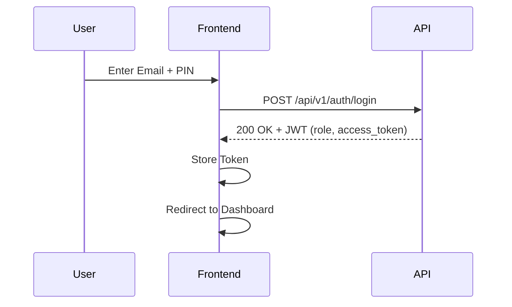

# Authentication Integration

Integration plan and implementation details for the 6te9 Admin Panel authentication system.

## Flow Overview
The authentication system uses a 2-factor style flow with Email and a 6-digit TOTP Pin.



## Endpoints

### Login (Standard)
- **URL**: `/api/v1/auth/login`
- **Method**: `POST`
- **Request Body**:
  ```json
  {
    "email": "user@example.com",
    "pin": "123456"
  }
  ```
- **Responses**:
  - `200`: Success (`TokenResponse`)
  - `422`: Validation Error
  - `401`: Unauthorized

### Login (Super Admin)
- **URL**: `/api/v1/auth/login/super-admin`
- **Method**: `POST`

## Security Requirements
- **Storage**: JWT stored in `localStorage` as `auth_token`.
- **Role Management**: Role returned from API determines access to "Identity Mgt" (Super Admin only).
- **Interceptors**: All subsequent API calls must include `Authorization: Bearer <token>`.
